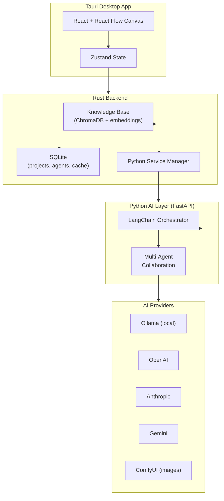
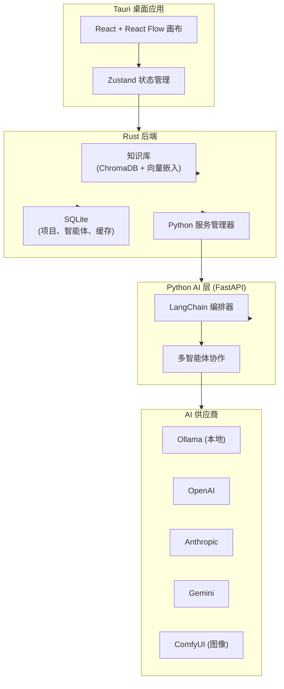

<p align="center">
  
</p>

<h1 align="center">Flowith</h1>

<p align="center">
  <strong>Orchestrate AI like a symphony conductor.<br>Not with code — with a canvas.</strong>
</p>

<p align="center">
  <a href="#-chinese">中文</a> &nbsp;|&nbsp;
  <a href="#features">Features</a> &nbsp;|&nbsp;
  <a href="#quick-start">Quick Start</a> &nbsp;|&nbsp;
  <a href="#architecture">Architecture</a>
</p>

---

# Flowith — Node-Based Multi-Agent AI Workflow Manager

**Flowith turns AI agents into visual building blocks.** Drag. Connect. Run. Watch multiple AI agents collaborate on a canvas — each with their own role, model, and personality — to tackle complex creative and analytical work that a single AI chat could never handle.

Think **ComfyUI, but for AI agents** — where every node is a specialist (researcher, writer, critic, coder, designer) and every connection is a handoff of insight.

---

## Why Flowith?

| Single AI Chat | Flowith |
|---|---|
| One model, one voice | Multiple specialized agents, each with their own system prompt & model |
| Linear Q&A | DAG (directed acyclic graph) — parallel branches, forks, merges |
| Re-type everything on retry | SHA-256 cache: only re-run what changed |
| Cloud-only, data leaves your machine | Local-first with Ollama — your data never leaves home |
| No structure | Visual canvas — see your entire workflow at a glance |
| English-only | Full i18n: English & 中文 |

---

## Features

### Visual Workflow Canvas
Drag and drop 7 node types — **Input**, **Task**, **Logic**, **Decision**, **Switch**, **Loop**, **Output** — onto an infinite canvas. Wire them together to define exactly how work flows.

### Multi-Agent Orchestration
Assign each Task node to a different AI agent. Each agent has its own **system prompt**, **model** (local or cloud), **temperature**, and **tool permissions**. Combine a researcher, a writer, a critic, and a proofreader into one automated pipeline.

### Bring Your Own Model
- **Local**: Ollama (any model — Llama, Mistral, Qwen, DeepSeek...)
- **Cloud**: OpenAI GPT-4o, Anthropic Claude, Google Gemini, or any OpenAI-compatible API
- **Privacy-first**: Local models run entirely on your machine

### Collaborative Intelligence
Beyond sequential handoffs, Flowith supports **debate mode**, **parallel review**, and **critique-refine loops** — agents challenge each other's outputs before passing work downstream.

### Smart Caching
Every node execution is hashed (SHA-256) based on its input + agent config. Change one node mid-pipeline? Only that node and its dependents re-run. Everything upstream stays green and cached — **zero wasted compute**.

### Knowledge Base
Upload documents, codebases, research papers — Flowith vectorizes them and injects relevant context into every agent execution automatically.

### Rich Output Preview
Agents produce more than text. The output panel renders **images**, **video**, **code blocks**, **JSON trees**, and **downloadable files** — all auto-detected from the agent's response.

### Undo / Redo
50-step snapshot history. Ctrl+Z / Ctrl+Shift+Z. Fearless experimentation.

### Built for Desktop
Tauri-native, not Electron. **~15MB download**, minimal memory footprint, plays nicely with GPU-heavy local models.

### Developer-Ready
- Structured logging with ring buffer, metrics dashboard, JSON/CSV export
- CI/CD: push to `master`, GitHub Actions builds macOS / Linux / Windows
- 9-tier error types with visual node indicators

---

## Quick Start

### macOS
1. Download `Flowith_1.0.0_aarch64.dmg` from [Releases](https://github.com/Roooounds/Flowith/releases)
2. Open and drag to Applications
3. Install [Ollama](https://ollama.com) if you want local models (optional — cloud API keys work too)
4. Launch Flowith

### From Source
```bash
git clone https://github.com/Roooounds/Flowith.git
cd Flowith
./release.sh
```

### First Launch
The launcher checks your system, installs missing dependencies, and walks you through a quick tutorial. **Five demo workflows** are pre-loaded so you can see what Flowith can do immediately.

---

## Architecture



---

## Tech Stack

| Layer | Technology |
|---|---|
| Desktop Shell | Tauri 2 (Rust) |
| Canvas | React Flow 12 |
| UI | React 18 + TypeScript + Tailwind CSS |
| State | Zustand |
| AI Backend | Python FastAPI + LangChain |
| Database | SQLite (via tauri-plugin-sql) |
| Vector DB | ChromaDB (via Rust FFI) |
| Local Models | Ollama |
| Testing | Vitest |

---

## 43 Preset Roles

Agents come pre-configured with expertly crafted system prompts — not generic "you are a helpful assistant" templates, but deeply specialized personas:

- **Strategy & Analysis**: CEO Advisor, Market Analyst, Risk Assessor, Data Scientist
- **Creative**: Copywriter, Storyteller, Script Writer, Character Designer, World Builder
- **Engineering**: Senior Architect, Code Reviewer, DevOps Engineer, Security Auditor
- **Design**: UX Director, Visual Designer, Motion Designer, HMI Designer
- **Operations**: Project Manager, Legal Reviewer, Technical Writer, QA Lead
- ...and 23 more, each with tuned temperature and tool permissions

You can create, edit, and share your own roles. The **Conversational Onboarding** feature lets you describe a role in plain language — Flowith converts it into a structured system prompt automatically.

---

## Example Use Cases

- **Game Design Pipeline**: World builder → Character designer → Dialogue writer → Localization reviewer → Storyboard artist
- **Code Review Assembly Line**: Code author → Static analysis → Peer reviewer → Security audit → Documentation generator
- **Content Factory**: Topic researcher → Outline creator → Draft writer → Editor → SEO reviewer → Social media adapter
- **Research Synthesis**: Paper collector → Summarizer → Cross-reference analyst → Gap identifier → Report writer
- **Contract Review**: Clause extractor → Risk flagger → Compliance checker → Redline generator → Summary writer

---

<h2 id="-chinese">🇨🇳 中文</h2>

<p align="center">
  <strong>像指挥交响乐一样编排 AI<br>不用代码，用画布</strong>
</p>

---

# Flowith — 节点式多智能体 AI 工作流管理器

**Flowith 把 AI 智能体变成了可视化积木。** 拖拽、连线、运行。在画布上观看多个 AI 智能体协作——每个智能体有自己的角色、模型和人格——完成单个 AI 对话永远无法处理的复杂创作和分析任务。

想象一下 **ComfyUI，但对象是 AI 智能体**——每个节点都是一位专家（研究员、作家、评论家、程序员、设计师），每条连线都是一次洞察的交接。

---

## 为什么选择 Flowith？

| 单一 AI 对话 | Flowith |
|---|---|
| 一个模型，一个声音 | 多个专业智能体，各自拥有独立的系统提示词和模型 |
| 线性问答 | DAG（有向无环图）——并行分支、分叉、汇聚 |
| 重试需要全部重来 | SHA-256 缓存：只重跑变更的部分 |
| 仅云端，数据离开你的机器 | 本地优先 + Ollama——数据永不离开你的设备 |
| 无结构 | 可视化画布——一眼看清整个工作流 |
| 仅英文 | 完整 i18n：英文 & 中文 |

---

## 核心功能

### 可视化工作流画布
拖拽 7 种节点类型——**输入、任务、逻辑、决策、开关、循环、输出**——到无限画布上。连线定义工作流的精确走向。

### 多智能体编排
将每个任务节点分配给不同的 AI 智能体。每个智能体拥有独立的**系统提示词**、**模型**（本地或云端）、**温度参数**和**工具权限**。将研究员、写手、评论家、校对组合成一条自动化流水线。

### 自由选择模型
- **本地**：Ollama（任意模型——Llama、Mistral、Qwen、DeepSeek……）
- **云端**：OpenAI GPT-4o、Anthropic Claude、Google Gemini、或任何兼容 OpenAI 接口的服务
- **隐私优先**：本地模型完全在你的机器上运行

### 协作式智能
超越简单的顺序交接，Flowith 支持**辩论模式**、**并行评审**和**批判-优化循环**——智能体在传递工作之前互相挑战对方的输出。

### 智能缓存
每次节点执行基于其输入 + 智能体配置计算 SHA-256 哈希值。在流水线中间修改一个节点？只有该节点及其下游依赖会重新执行。上游全部保持绿色缓存状态——**零算力浪费**。

### 知识库
上传文档、代码库、研究论文——Flowith 将它们向量化，并在每次智能体执行时自动注入相关上下文。

### 富媒体输出预览
智能体产出的不只是文字。输出面板渲染**图片**、**视频**、**代码块**、**JSON 树**和**可下载文件**——全部从智能体回复中自动识别。

### 撤销/重做
50 步快照历史。Ctrl+Z / Ctrl+Shift+Z。大胆实验，无后顾之忧。

### 桌面原生
Tauri 原生应用，非 Electron。**约 15MB 下载体积**，极低内存占用，与 GPU 密集型本地模型和平共处。

### 开发者友好
- 结构化日志（环形缓冲区、指标仪表盘、JSON/CSV 导出）
- CI/CD：推送至 `master`，GitHub Actions 自动构建 macOS / Linux / Windows
- 9 级分层错误类型，节点可视化提示

---

## 快速开始

### macOS
1. 从 [Releases](https://github.com/Roooounds/Flowith/releases) 下载 `Flowith_1.0.0_aarch64.dmg`
2. 打开并拖入 Applications
3. 如需本地模型，安装 [Ollama](https://ollama.com)（可选——云端 API Key 同样可用）
4. 启动 Flowith

### 从源码构建
```bash
git clone https://github.com/Roooounds/Flowith.git
cd Flowith
./release.sh
```

### 首次启动
启动器会检测系统环境、安装缺失依赖，并用教程引导你上手。**五个演示工作流**已预加载，让你即刻体验 Flowith 的能力。

---

## 43 个预设角色

智能体预装了精心设计的系统提示词——不是泛泛的"你是一个有用的助手"，而是深度专业化的角色：

- **策略与分析**：CEO 顾问、市场分析师、风险评估师、数据科学家
- **创意**：文案、故事家、编剧、角色设计师、世界观构建师
- **工程**：资深架构师、代码评审、DevOps 工程师、安全审计师
- **设计**：UX 总监、视觉设计师、动效设计师、HMI 设计师
- **运营**：项目经理、法务评审、技术文档、QA 负责人
- ……以及另外 23 个，每个都调校了温度和工具权限

你可以创建、编辑和分享自己的角色。**对话式入职**功能让你用自然语言描述一个角色——Flowith 自动将其转化为结构化系统提示词。

---

## 示例场景

- **游戏设计流水线**：世界观构建师 → 角色设计师 → 对白写手 → 本地化审校 → 故事板画师
- **代码审查装配线**：代码作者 → 静态分析 → 同行评审 → 安全审计 → 文档生成器
- **内容工厂**：选题研究员 → 大纲创建 → 初稿撰写 → 编辑 → SEO 评审 → 社媒适配
- **研究综合**：论文收集 → 摘要提炼 → 交叉引用分析 → 空白识别 → 报告撰写
- **合同审查**：条款提取 → 风险标记 → 合规检查 → 修改建议 → 摘要生成

---

## 系统架构



---

## 技术栈

| 层级 | 技术 |
|---|---|
| 桌面壳 | Tauri 2 (Rust) |
| 画布 | React Flow 12 |
| UI | React 18 + TypeScript + Tailwind CSS |
| 状态管理 | Zustand |
| AI 后端 | Python FastAPI + LangChain |
| 数据库 | SQLite (via tauri-plugin-sql) |
| 向量数据库 | ChromaDB (via Rust FFI) |
| 本地模型 | Ollama |
| 测试 | Vitest |

---

## License

MIT — free to use, modify, and share.

---

<p align="center">
  <strong>Stop chatting with AI. Start orchestrating it.</strong><br>
  <strong>别跟 AI 聊天了。开始编排它。</strong>
</p>
